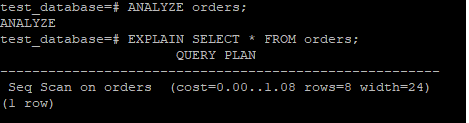
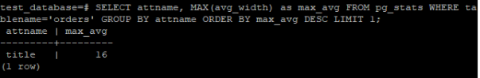

# Домашнее задание к занятию "6.4. PostgreSQL"

## Задача 1

`docker run --name 0604
  -d
  --rm
  --env-file var.env
  -v ./data:/var/lib/postgresql/data/pgdata:z
  postgres:13`

`cat var.env`
>POSTGRES_PASSWORD=pass
>
>PGDATA=/var/lib/postgresql/data/pgdata

`docker exec -it 0604 psql -U postgres`

вывода списка БД `\l`

подключения к БД `\c`

вывода списка таблиц `\dt *`

вывода описания содержимого таблиц `\d NAME`

выхода из psql `\q`
  
## Задача 2

`postgres=# CREATE DATABASE test_database;`

`docker exec -i 0604 sh -c ‘psql -U postgres test_database’ < test_dump.sql`

`docker exec -it 0604 psql -U postgres`

`postgres=# \c test_database;`

`SELECT attname, MAX(avg_width) as max_avg FROM pg_stats WHERE tablename='orders' GROUP BY attname ORDER BY max_avg DESC LIMIT 1;`

## Задача 3

>BEGIN;
>
>ALTER TABLE orders RENAME TO orders_bak;
>
>CREATE TABLE orders (
  id integer NOT NULL,
  title character varying(80) NOT NULL,
  price integer DEFAULT 0
) PARTITION BY RANGE (price);
>
>CREATE TABLE orders_1 PARTITION OF orders FOR VALUES FROM (500) TO (MAXVALUE);
>
>CREATE TABLE orders_2 PARTITION OF orders FOR VALUES FROM (MINVALUE) TO (500);
>
>INSERT INTO orders_1 SELECT * FROM orders_bak WHERE price >=500;
>
>INSERT INTO orders_2 SELECT * FROM orders_bak WHERE price <500;
>
>DROP TABLE orders_bak;
>
> COMMIT;

Чтобы исключить ручное разбиение при проектировании, нужно использовать сторонние утилиты, например, pg_partman

## Задача 4

Под пользователем postgres в контейере выполнить
`pg_dump test_database > /tmp/backup.sql`

Чтобы добавить уникальность значения столбца title для таблиц test_database в бэкап файл добавляем
>ALTER TABLE orders ADD CONSTRAINT orders_title_key UNIQUE (title);