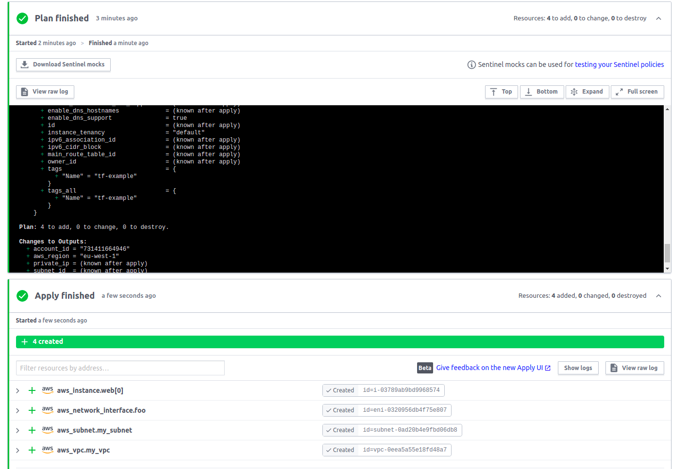

# Домашнее задание к занятию "7.4. Средства командной работы над инфраструктурой."

## Задача 1

## Задача 2
[server.yaml](server.yaml)

[atlantis.yaml](atlantis.yaml)

## Задача 3
[ec2-instance](https://registry.terraform.io/modules/terraform-aws-modules/ec2-instance/aws/latest)

Буду использовать ресурс, тк модуль состоит из одного ресурса.

[main.tf](main.tf)