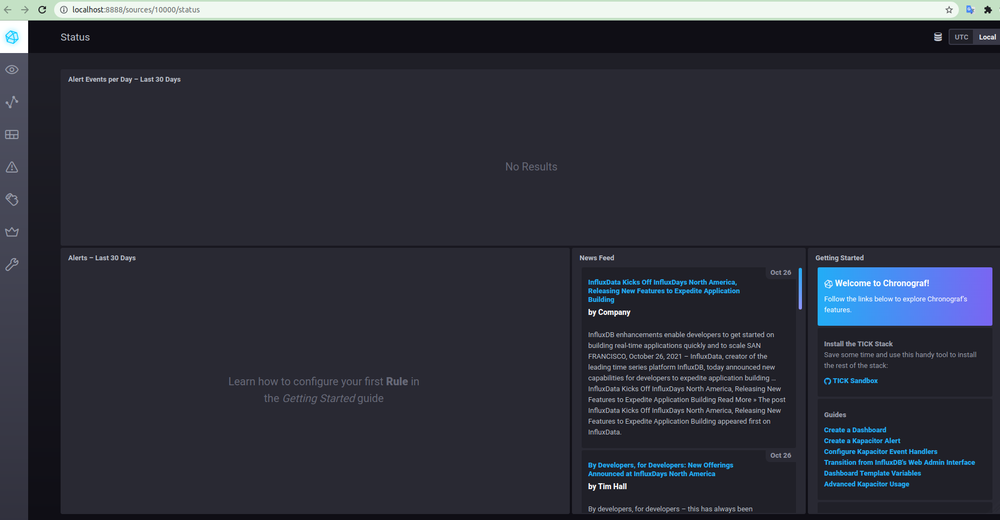
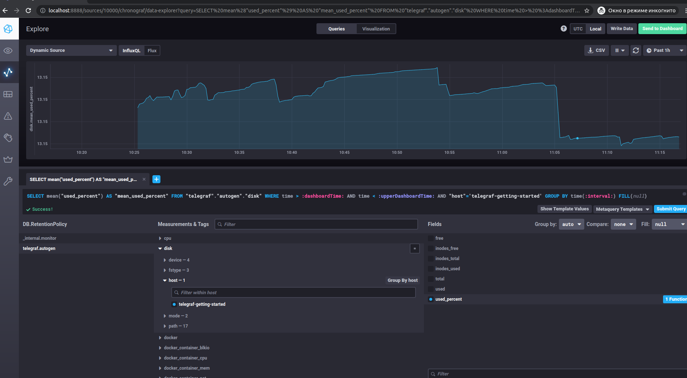
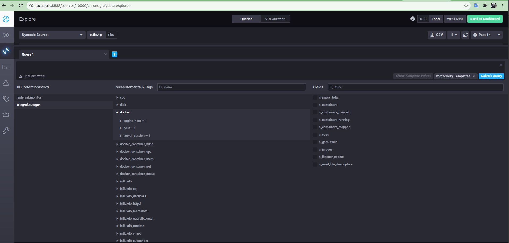

# Домашнее задание к занятию "10.02. Системы мониторинга"

## Обязательные задания

1. Опишите основные плюсы и минусы pull и push систем мониторинга.

```
push:
+ работает по протоколу UDP (выше скорость передачи)
+ отправка данных в несколько систем мониторинга
+ гибкое управление частотой отправки данных
- работает по протоколу UDP (данные могут не дойти))
- достоверность данных не гарантирована
- сложность отладки
pull:
+ достоверность данных
+ удобство администрирования большого число однотипных источников данных
+ отладка проще
- центрального узла должен быть надежными
- доступ к каждому из источников данных (настройка файрвола)
- меньше гибкость в управлении источниками данных
```


2. Какие из ниже перечисленных систем относятся к push модели, а какие к pull? А может есть гибридные?

    - Prometheus - pull
    - TICK - push
    - Zabbix - push
    - VictoriaMetrics - pull&push
    - Nagios - pull&push

3. Склонируйте себе [репозиторий](https://github.com/influxdata/sandbox/tree/master) и запустите TICK-стэк, 
используя технологии docker и docker-compose.

В виде решения на это упражнение приведите выводы команд с вашего компьютера (виртуальной машины):

    - curl http://localhost:8086/ping
    - curl http://localhost:8888
    - curl http://localhost:9092/kapacitor/v1/ping

```
curl http://localhost:8086/ping -v
*   Trying 127.0.0.1:8086...
* TCP_NODELAY set
* Connected to localhost (127.0.0.1) port 8086 (#0)
> GET /ping HTTP/1.1
> Host: localhost:8086
> User-Agent: curl/7.68.0
> Accept: */*
> 
* Mark bundle as not supporting multiuse
< HTTP/1.1 204 No Content
< Content-Type: application/json
< Request-Id: e064a630-3680-11ec-80a3-0242ac130003
< X-Influxdb-Build: OSS
< X-Influxdb-Version: 1.8.10
< X-Request-Id: e064a630-3680-11ec-80a3-0242ac130003
< Date: Tue, 26 Oct 2021 17:19:29 GMT
< 
* Connection #0 to host localhost left intact


curl http://localhost:8888
<!DOCTYPE html><html><head><meta http-equiv="Content-type" content="text/html; charset=utf-8"><title>Chronograf</title><link rel="icon shortcut" href="/favicon.fa749080.ico"><link rel="stylesheet" href="/src.3dbae016.css"></head><body> <div id="react-root" data-basepath=""></div> <script src="/src.fab22342.js"></script> </body></html>


curl http://localhost:9092/kapacitor/v1/ping -v
*   Trying 127.0.0.1:9092...
* TCP_NODELAY set
* Connected to localhost (127.0.0.1) port 9092 (#0)
> GET /kapacitor/v1/ping HTTP/1.1
> Host: localhost:9092
> User-Agent: curl/7.68.0
> Accept: */*
> 
* Mark bundle as not supporting multiuse
< HTTP/1.1 204 No Content
< Content-Type: application/json; charset=utf-8
< Request-Id: cc664c9b-3680-11ec-808f-000000000000
< X-Kapacitor-Version: 1.6.2
< Date: Tue, 26 Oct 2021 17:18:55 GMT
< 
* Connection #0 to host localhost left intact
```

А также скриншот веб-интерфейса ПО chronograf (`http://localhost:8888`). 




4. Перейдите в веб-интерфейс Chronograf (`http://localhost:8888`) и откройте вкладку `Data explorer`.

    - Нажмите на кнопку `Add a query`
    - Изучите вывод интерфейса и выберите БД `telegraf.autogen`
    - В `measurments` выберите mem->host->telegraf_container_id , а в `fields` выберите used_percent. 
    Внизу появится график утилизации оперативной памяти в контейнере telegraf.
    - Вверху вы можете увидеть запрос, аналогичный SQL-синтаксису. 
    Поэкспериментируйте с запросом, попробуйте изменить группировку и интервал наблюдений.

Для выполнения задания приведите скриншот с отображением метрик утилизации места на диске 
(disk->host->telegraf_container_id) из веб-интерфейса.



5. Изучите список [telegraf inputs](https://github.com/influxdata/telegraf/tree/master/plugins/inputs). 
Добавьте в конфигурацию telegraf следующий плагин - [docker](https://github.com/influxdata/telegraf/tree/master/plugins/inputs/docker):
```
[[inputs.docker]]
  endpoint = "unix:///var/run/docker.sock"
```

Дополнительно вам может потребоваться донастройка контейнера telegraf в `docker-compose.yml` дополнительного volume и 
режима privileged:
```
  telegraf:
    image: telegraf:1.4.0
    privileged: true
    volumes:
      - ./etc/telegraf.conf:/etc/telegraf/telegraf.conf:Z
      - /var/run/docker.sock:/var/run/docker.sock:Z
    links:
      - influxdb
    ports:
      - "8092:8092/udp"
      - "8094:8094"
      - "8125:8125/udp"
```

После настройке перезапустите telegraf, обновите веб интерфейс и приведите скриншотом список `measurments` в 
веб-интерфейсе базы telegraf.autogen . Там должны появиться метрики, связанные с docker.


