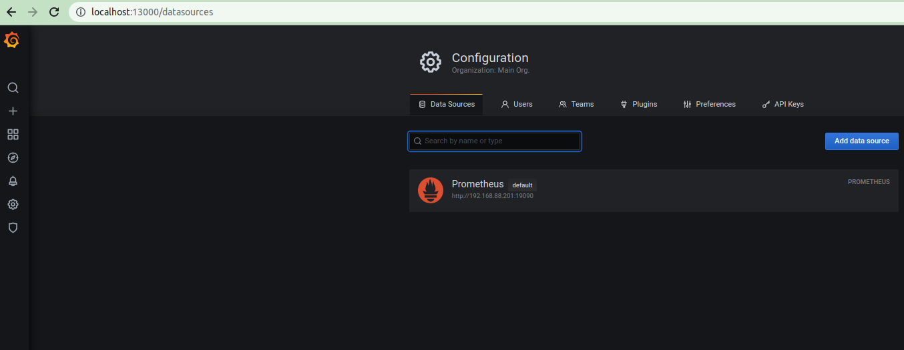
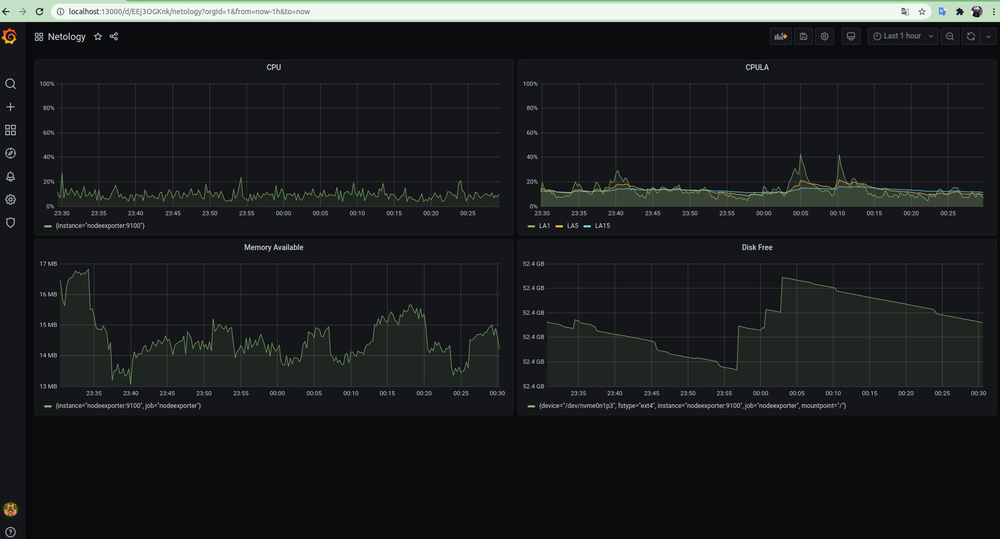
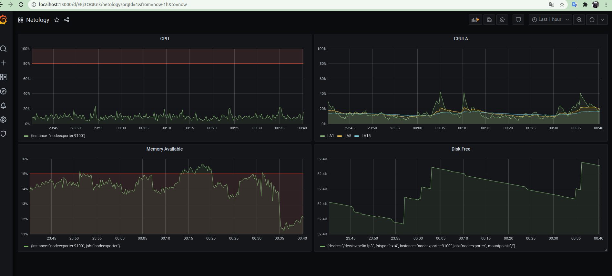

# Домашнее задание к занятию "10.03. Grafana"

## Обязательные задания

### Задание 1
Используя директорию [help](./help) внутри данного домашнего задания - запустите связку prometheus-grafana.

Зайдите в веб-интерфейс графана, используя авторизационные данные, указанные в манифесте docker-compose.

Подключите поднятый вами prometheus как источник данных.

Решение домашнего задания - скриншот веб-интерфейса grafana со списком подключенных Datasource.



## Задание 2
Изучите самостоятельно ресурсы:
- [promql-for-humans](https://timber.io/blog/promql-for-humans/#cpu-usage-by-instance)
- [understanding prometheus cpu metrics](https://www.robustperception.io/understanding-machine-cpu-usage)

Создайте Dashboard и в ней создайте следующие Panels:
- Утилизация CPU для nodeexporter (в процентах, 100-idle)
```
100 - (avg by (instance) (irate(node_cpu_seconds_total{mode="idle"}[5m])) * 100)
```
- CPULA 1/5/15
```
avg(node_load1) / count(count(node_cpu_seconds_total) by (cpu)) * 100
avg(node_load5) / count(count(node_cpu_seconds_total) by (cpu)) * 100
avg(node_load15) / count(count(node_cpu_seconds_total) by (cpu)) * 100
```
- Количество свободной оперативной памяти
```
(node_memory_MemAvailable_bytes * 100) / node_memory_MemTotal_bytes
```
- Количество места на файловой системе
```
(node_filesystem_avail_bytes{mountpoint="/",fstype!="rootfs"} * 100) / node_filesystem_size_bytes{mountpoint="/",fstype!="rootfs"}
```

Для решения данного ДЗ приведите promql запросы для выдачи этих метрик, а также скриншот получившейся Dashboard.


## Задание 3
Создайте для каждой Dashboard подходящее правило alert (можно обратиться к первой лекции в блоке "Мониторинг").

Для решения ДЗ - приведите скриншот вашей итоговой Dashboard.



## Задание 4
Сохраните ваш Dashboard.s

Для этого перейдите в настройки Dashboard, выберите в боковом меню "JSON MODEL".

Далее скопируйте отображаемое json-содержимое в отдельный файл и сохраните его.

В решении задания - приведите листинг этого файла.

[листинг](dashboard.json)

---